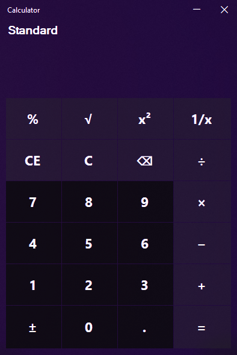

# Minimal Cal

A lightweight calculator for Windows built with C# and .NET Windows Forms, with a dark frosted glass interface.

Windows updates have not optimized the default calculator, which is large in size, or refreshed its UI. Minimal Cal is a small, clean alternative.

## Features
* Frosted glass (acrylic) window with a custom title bar
* Standard arithmetic: addition, subtraction, multiplication and division
* Type full equations, with the equation shown in the display
* Keyboard input

## Tech Stack
* **Language:** C#
* **Framework:** .NET Framework 4.7.2 (Windows Forms)
* **IDE:** Visual Studio

## Download

The latest `.exe` can be found in the [Releases](https://github.com/lynx7843/Minimal-Cal/releases) section.

## Getting Started

1. Clone the repository:
   ```bash
   git clone https://github.com/lynx7843/Minimal-Cal.git
   ```
2. Open `Minimal Cal.sln` in Visual Studio.
3. Press `F5` to build and run.

## Preview


